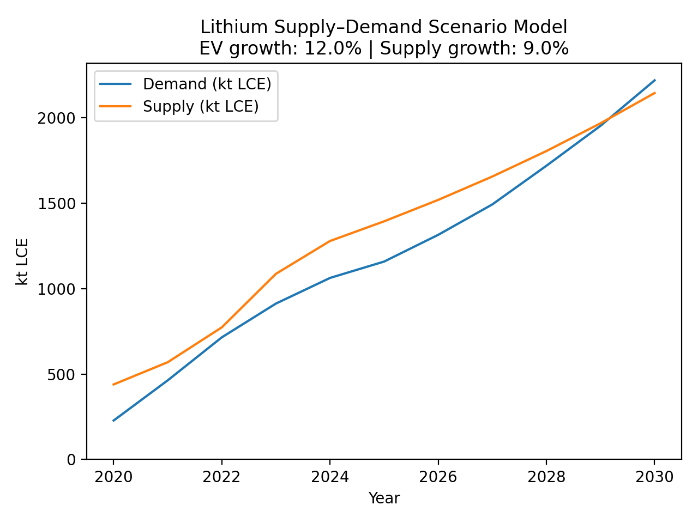

# リチウム需給シナリオモデル



## 概要

このプロジェクトは、2020年から2030年までのリチウム需給バランスをシミュレーションする、Pythonベースのシナリオモデルです。  
IEAおよびUSGSの見通しデータをもとに、EV販売台数とリチウム供給量に一定の成長率を仮定し、市場全体の需給バランスにどのような影響を与えるかを分析します。

- 単位：LCE（炭酸リチウム換算）
- 過去データは2024年まで使用  
  （USGSの供給データは2023年まで実績値、2024年は推計値）
- 2025年以降は一定成長率を前提とした将来推計

---

## 背景

リチウム価格を直接予測することには大きな不確実性があります。  
そのため本モデルでは価格予測を行うのではなく、需要と供給の構造的な関係に着目しています。  

前提条件を明示したうえでモデル化することで、より一貫性があり、規律ある投資判断に役立てることを目的としています。

---

## モデル構造

- **EV由来の需要（kt LCE）**  
  = EV販売台数 × 1台あたりのLCE使用量

- **総リチウム需要**  
  = EV由来の需要 ×（1 / リチウム総需要に占めるEV用途比率）

- **純リチウム需要**  
  = 総需要 ×（1 − リサイクル率）

- **総リチウム供給**  
  = 前年の供給量 ×（1 + 供給成長率）

---

## シナリオ前提

- EV年間成長率：12%
- 供給年間成長率：9%

---

## 主要パラメータ

- EV1台あたりのLCE使用量：48 kg
- リサイクル率：5%
- 分析期間：2020年〜2030年

---
## プロジェクト構成

```text
.
├── Lithium_model.py
└── data/
    ├── ev_sales_iea.csv
    └── supply_usgs.csv
```

---

## 実行方法

1. ファイルを上記のプロジェクト構成に合わせて配置します。

2. 次のスクリプトを実行します。

```
python Lithium_model.py
```

3. 2020年から2030年までのリチウム需給シナリオモデルが生成されます。
---
## データソース

- **EV販売データ**: IEA（国際エネルギー機関）『Global EV Outlook 2025』 — 世界のEV販売台数
- **リチウム供給データ**:USGS（米国地質調査所）『Mineral Commodity Summaries 2022〜2025』 — LCE換算したリチウム生産量

---

## 動作環境

- Python 3.9+
- pandas
- numpy
- matplotlib

---

## 作者


Kenta Nagasaki


